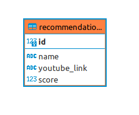

<h1 align="center">
   🎤 <a href="#"> Sing me a Song API </a>
</h1>

<h3 align="center">
    Dope recommendations of songs for you 
</h3>

<h4 align="center"> 
	 Status: On development
</h4>

<p align="center">
 <a href="#about">About</a> •
 <a href="#database-layout">Database Layout</a> • 
 <a href="#pre-requisites">Pre-requisites</a> • 
 <a href="#routes">Routes</a> • 
 <a href="#tech-stack">Tech Stack</a> • 
 <a href="#how-to-contribute">How to contribute</a> • 
 <a href="#author">Author</a>
</p>

## About

This is an "API" that returns music recommendations for you. It can return you a random song or list the top # of our rankings. you can also vote to help make our recommendations even better!

---

## Database Layout

<h1 align="center">

</h1>

The database was designed at https://www.dbdesigner.net/ for PostgreSQL.

```postgresql

/* In your psql terminal */
CREATE DATABASE singmeasong;

/* Access the database */
\c singmeasong

```

Now, just run the commands listed in <a href="https://github.com/samuelfcf/singmeasong-api/blob/main/dump.sql">dump.sql</a>

---

## Pre-requisites

Before starting, you will need to have the following tools installed on your machine:
[Git](https://git-scm.com), [Node.js](https://nodejs.org/en/), [VSCode](https://code.visualstudio.com/).

### Running the Backend (server)

```bash

# Clone this repository
$ git clone https://github.com/samuelfcf/singmeasong-api

# Access the project folder cmd/terminal
$ cd singmeasong-api

# Install the dependencies
$ npm install

# Using yarn
$ yarn install

# Create a .env.dev file and fill it using your environment variables following the .env.example

# Run the application in development mode
$ npx ntl -> start:dev

# The server will start at port: 4000

```

You can find the .env.example <a href="https://github.com/samuelfcf/singmeasong-api/blob/main/.env.exemple">here</a>

---

## Routes

Requests for the API must follow the standards:
| Method | Path | Description | Request body
|---|---|---|---|
| `POST` | /recommendations | Register new recomendation | `{ name: , youtubeLink: }` |
| `POST` | /recommendations/:id/upvote | Adds a point to recommendation score. Requires the music id as request parameter | `Do not expect anything in the body` |
| `POST` | /recommendations/:id/downvote | Removes a point from recommendation score. Requires the music id as request parameter | `Do not expect anything in the body` |
| `GET` | /recommendations/random | Returns a random recommendation. | `Do not expect anything in the body` |
| `GET` | /recommendations/top/:amount | Returns top X of our ranking. You can set amount on the query parameter | `Do not expect anything in the body` |

---

## Tech Stack

The following tools were used in the construction of the project-api:

**Server** ([NodeJS](https://nodejs.org/en/))

- **[Express](https://expressjs.com/)**
- **[NTL](https://github.com/ruyadorno/ntl)**
- **[Pg](https://github.com/brianc/node-postgres)**
- **[DotENV](https://github.com/motdotla/dotenv)**
- **[Faker](https://github.com/Marak/Faker.js)**
- **[Joi](https://github.com/hapijs/joi)**
- **[Jest](https://github.com/facebook/jest)**
- **[Supertest](https://github.com/visionmedia/supertest)**
- **[Eslint - Airbnb](https://github.com/airbnb/javascript)**
- **[Prettier](https://github.com/prettier/prettier)**

> See the file [package.json](https://github.com/samuelfcf/singmeasong-api/blob/main/package.json)

**Utilitários**

- Editor: **[Visual Studio Code](https://code.visualstudio.com/)**
- API Test: **[Insomnia](https://insomnia.rest/)**, **[Thunder Client](https://www.thunderclient.io/)**

---

## How to contribute

1. Fork the project.
2. Create a new branch with your changes: `git checkout -b feat/myFeatureName`
3. For each feature implemented, make a commit specifying what was done
4. Submit your changes: `git push -u origin feat/myFeatureName`

---

## Author

Developed with ❤️ by Samuel Felipe Castro Fernandes.
